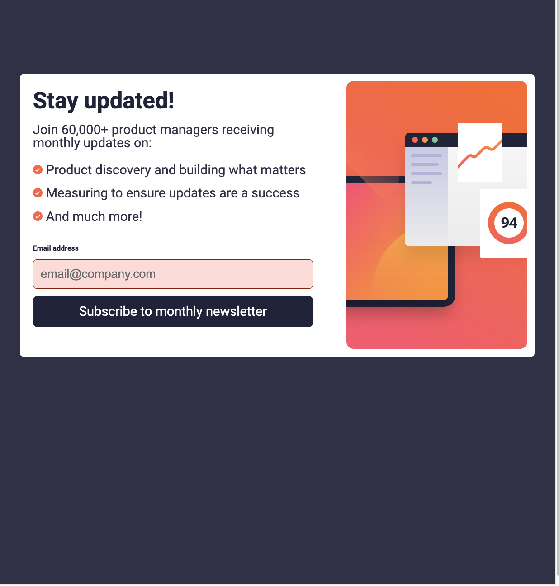

# Frontend Mentor - Newsletter sign-up form with success message solution

This is a solution to the [Newsletter sign-up form with success message challenge on Frontend Mentor](https://www.frontendmentor.io/challenges/newsletter-signup-form-with-success-message-3FC1AZbNrv). Frontend Mentor challenges help you improve your coding skills by building realistic projects.

## Table of contents

- [Overview](#overview)
  - [The challenge](#the-challenge)
  - [Screenshot](#screenshot)
  - [Links](#links)
- [My process](#my-process)
  - [Built with](#built-with)
  - [What I learned](#what-i-learned)
  - [Continued development](#continued-development)
  - [Useful resources](#useful-resources)
- [Author](#author)

**Note: Delete this note and update the table of contents based on what sections you keep.**

## Overview

### The challenge

Users should be able to:

- Add their email and submit the form
- See a success message with their email after successfully submitting the form
- See form validation messages if:
  - The field is left empty
  - The email address is not formatted correctly
- View the optimal layout for the interface depending on their device's screen size
- See hover and focus states for all interactive elements on the page

### Screenshot

### Links

- Solution URL: [Github repo](https://github.com/mrcordova/newsletter-sign-up-with-success-message-main)
- Live Site URL: [Github page](https://mrcordova.github.io/newsletter-sign-up-with-success-message-main/)

## My process

### Built with

- Semantic HTML5 markup
- CSS custom properties
- Flexbox
- CSS Grid
- Mobile-first workflow

### What I learned

I learned how to check validation.

### Continued development

Learn more about validation and how to use grid more effectively.

### Useful resources

- [Prevent grid item expandation](https://stackoverflow.com/questions/43311943/prevent-content-from-expanding-grid-items) - How to prevent grid items take up all aviable space.

- [Button styling](https://stackoverflow.com/questions/2460100/remove-the-complete-styling-of-an-html-button-submit) - This helped on how to remove styling from buttons.

- [How to align list item marker](https://stackoverflow.com/questions/69874236/how-can-i-vertically-align-a-list-item-marker)
  ) - This helped on how to work with list item markers.

- [How to work with margin for different margin sizes](https://stackoverflow.com/questions/21952994/ways-to-change-margin-by-screen-size)
  ) - This helped on how more effective margin.

## Author

- Website - [mrcordova](https://github.com/mrcordova)
- Frontend Mentor - [@mrcordova](https://www.frontendmentor.io/profile/mrcordova)
- Twitter - [@yourusername](https://www.twitter.com/yourusername)
